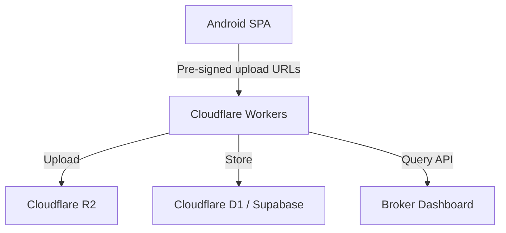

# StoreFront Lens

## Full Application Development Plan
### Ground‑Truth Storefront Imagery & Business Intelligence Data Pipeline

---

## 1. Product Vision
**StoreFront Lens** is a field‑data capture SPA (Single Page Application) for Android that empowers operators to collect high‑quality, verified storefront photos with rich business metadata. Captures are uploaded directly to Cloudflare R2, enhanced with automated quality checks and OCR, and exposed to data brokers through a secure query API – turning raw street‑level imagery into a sellable, structured dataset.

---

## 2. Core Value Proposition
- **For data brokers:** Searchable, validated, geo‑tagged storefront images bundled with business name, category, visible contact details, and capture provenance.
- **For field agents:** A guided, offline‑capable capture tool that enforces quality at the moment of capture, minimising rework.
- **For platform owners:** A fully serverless, scalable pipeline with zero‑trust security and minimal operational overhead.

---

## 3. High‑Level Architecture


- **Client:** Offline‑first mobile app with embedded ML (blur detection, face blurring, OCR).
- **Edge API:** Cloudflare Workers for authentication, pre‑signed URLs, metadata ingestion, and query endpoints.
- **Storage:** R2 for raw images + on‑the‑fly compression/transformation via Cloudflare Images (optional).
- **Database:** Serverless relational DB (D1/Supabase) storing metadata, quality scores, and business annotations.

---

## 4. Key Features (MVP → V1.0)

### 4.1 Core Capture & Metadata (MVP)
- **Direct upload to R2** via pre‑signed URLs (no server passing).
- **Image details table:** filename, resolution, GPS, reverse‑geocoded address, orientation (portrait/landscape), capture timestamp.
- **Device sensor input:** gyroscope/accelerometer roll, pitch, yaw → compute skew angle.
- **EXIF enrichment:** embed capture UUID in image comment.

### 4.2 Security & Access Control
- Agent authentication (email/password, SSO) using JWTs.
- Token‑based scoped access: each agent gets temporary upload credentials.
- Role‑based access (agent, reviewer, admin).

### 4.3 Quality Assurance at Capture Time
- **On‑device checks:**
  - Blur detection (Laplacian variance).
  - Minimum resolution & adequate lighting check.
  - GPS accuracy threshold (<10m) with manual override.
- **Capture guidance overlay:** alignment grid, bounding box for storefront.
- Mandatory re‑capture if any quality flag fails, with clear feedback.

### 4.4 Business Metadata Enrichment
- **Manual input:** business name, category (dropdown), phone/website on signage, opening hours.
- **Edge OCR (on‑device ML Kit/Tesseract):** auto‑extract text from signage, pre‑fill fields, allow correction.
- **Reverse geocoding & address validation:** suggest address → agent confirms/edits street name & building number.

### 4.5 Offline‑First Smart Sync
- Local SQLite/Room database for pending uploads.
- Queue management: view pending, failed, synced items.
- Background auto‑sync with collision detection and deduplication.
- Manual retry and swipe‑to‑delete on queued submissions.

### 4.6 Cloud Metadata Database & Query API
- Schema: `submissions` table with all technical + business fields, quality scores, device info.
- RESTful API (Workers):
  - `POST /upload` – returns pre‑signed URL.
  - `POST /metadata` – after upload, store metadata record.
  - `GET /submissions` – filter by geofence, category, date, quality score.
  - `GET /export` – download as GeoJSON, CSV, or Parquet with pre‑signed image download links.
- Broker dashboard (web) for search, map view, and export.

### 4.7 Privacy & Compliance Automation
- On‑device face & licence plate blurring before upload (ML Kit).
- Per‑image anonymisation audit log: blurring applied, model version, operator ID.
- Configurable compliance templates (GDPR, CCPA) to enable/disable blurring per project.

### 4.8 Image Pre‑processing
- Configurable JPEG compression (quality, max dimension) before upload.
- Auto‑rotation based on EXIF orientation.
- Optional auto‑enhance (contrast, white balance) to normalise batch appearance.

---

## 5. Development Phases

| Phase | Focus | Deliverables |
|-------|-------|--------------|
| **Phase 0 – Foundation** | Auth, R2 upload, basic metadata capture | – Login system<br>– Camera with GPS & EXIF metadata<br>– Direct upload to R2 via pre‑signed URLs<br>– Basic metadata table in cloud DB |
| **Phase 1 – Quality & Enrichment** | QA checks, business data | – Blur/lighting/resolution checks & guidance overlay<br>– Sensor‑based skew calculation<br>– Manual business fields + OCR prototype |
| **Phase 2 – Offline & Sync** | Offline resilience | – Local queue (SQLite)<br>– Background sync with retry logic<br>– Reverse geocoding & address confirmation |
| **Phase 3 – Cloud Product** | API, dashboard, export | – Metadata ingestion API<br>– Filter & export endpoints (GeoJSON, CSV)<br>– Basic broker web dashboard |
| **Phase 4 – Compliance & Polish** | Privacy, image processing, hardening | – Face/plate blurring on‑device<br>– Auto‑enhance & compression settings<br>– Audit trails & role‑based access<br>– Performance optimisation |

---

## 6. Recommended Technology Stack

**Mobile (SPA)**  
- *Framework:* Flutter (Dart) or React Native – Flutter preferred for camera/ML plugin maturity.  
- *Local DB:* `sqflite` (Flutter) / `Room` (React Native with native modules).  
- *ML/Image:* `google_ml_kit` for blur detection, face detection, OCR.  
- *Sensors:* `sensors_plus` (Flutter) for gyroscope/accelerometer.

**Backend (Edge)**  
- *API:* Cloudflare Workers (TypeScript/JavaScript).  
- *Storage:* Cloudflare R2, with Cloudflare Images for optional on‑the‑fly resizing.  
- *Database:* Cloudflare D1 (SQLite) or Supabase (PostgreSQL) – D1 for tight Workers integration.  
- *Auth:* Cloudflare Access or Supabase Auth.

**Broker Dashboard**  
- *Frontend:* Next.js (React) hosted on Cloudflare Pages.  
- *Map:* MapLibre GL JS or Leaflet with OpenStreetMap tiles.  
- *Deployment:* Pages + Workers for API routes.

**DevOps**  
- *CI/CD:* GitHub Actions for mobile builds (App Center/Google Play), Workers deploy with Wrangler CLI.  
- *Monitoring:* Cloudflare Analytics + Sentry for crash reporting.

---

## 7. Database Schema (Core `submissions` Table)
```sql
CREATE TABLE submissions (
  id            UUID PRIMARY KEY,
  agent_id      TEXT NOT NULL,
  captured_at   TIMESTAMP NOT NULL,
  filename      TEXT NOT NULL,
  r2_object_key TEXT NOT NULL,
  resolution    TEXT, -- "WIDTHxHEIGHT"
  portrait      BOOLEAN,
  gps_lat       REAL,
  gps_long      REAL,
  gps_accuracy  REAL,
  street_name   TEXT,
  building_no   TEXT,
  country       TEXT,
  business_name TEXT,
  category      TEXT,
  phone_visible TEXT,
  website_visible TEXT,
  opening_hours TEXT,
  ocr_text      TEXT,
  skew_angle    REAL,
  roll          REAL,
  pitch         REAL,
  yaw           REAL,
  blur_score    REAL,
  lighting_score REAL,
  quality_flags TEXT, -- JSON
  face_blurred  BOOLEAN,
  plate_blurred BOOLEAN,
  device_model  TEXT,
  os_version    TEXT,
  app_version   TEXT,
  upload_status TEXT DEFAULT 'pending',
  created_at    TIMESTAMP DEFAULT CURRENT_TIMESTAMP
);
```

---

## 8. API Endpoints (Workers)

| Method | Path | Description |
| :--- | :--- | :--- |
| POST | /auth/login | Agent login, returns JWT |
| POST | /upload/url | Returns pre‑signed PUT URL for R2 |
| POST | /metadata | Store submitted metadata record |
| GET | /submissions | Query submissions (filters: bbox, category, date, quality) |
| GET | /submissions/{id} | Single record with download link |
| GET | /export | Generate export file (GeoJSON, CSV, Parquet) |
| GET | /health | Health check |

---

## 9. Deployment & Git Repository Structure

```text
/storefront-lens
├── /mobile            # Flutter app
├── /workers           # Cloudflare Workers (API)
├── /dashboard         # Broker web dashboard (Next.js)
├── /docs              # Architecture, API docs, user guides
├── /schema            # SQL migration files
├── README.md
└── .github/workflows  # CI/CD pipelines
```

---

## 10. Roadmap to V1.0 (12 Weeks)

- **Week 1‑2:** Auth, basic camera with EXIF, pre‑signed upload, cloud DB setup.
- **Week 3‑4:** Quality checks (blur, lighting, alignment overlay), sensor integration, skew.
- **Week 5‑6:** Business metadata fields + on‑device OCR.
- **Week 7‑8:** Offline queue, sync engine, reverse geocoding & address validation.
- **Week 9‑10:** API querying, export endpoints, broker dashboard MVP.
- **Week 11‑12:** Privacy blurring, compression, testing, hardening, documentation, App Store submission.

---

## 11. Success Metrics

- **Capture success rate:** ≤ 5% quality‑related rejection.
- **Upload latency:** < 3s on 4G.
- **Offline sync reliability:** > 99% of queued items uploaded within 5 minutes of reconnection.
- **Broker satisfaction:** NPS ≥ 50 from pilot clients.
- **Cost per submission:** < $0.005 (including storage & compute).

*Note: This plan assumes a small, focused development team (2‑3 engineers). Adjust timeline accordingly with more resources.*
